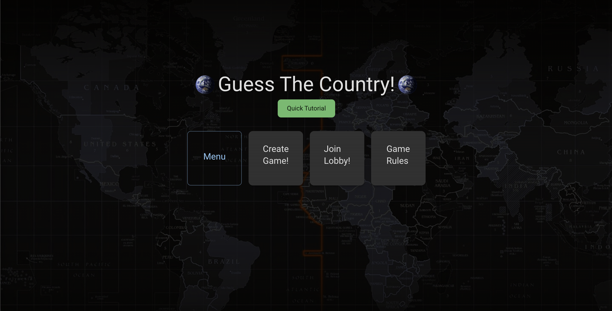
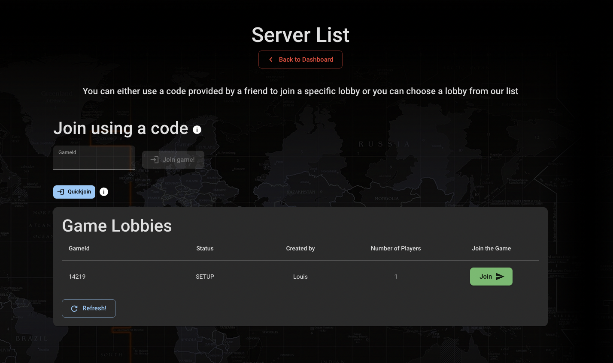
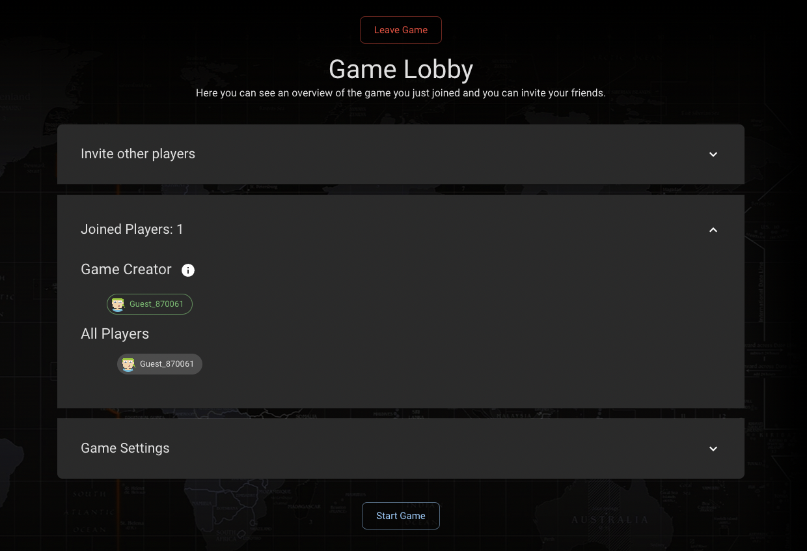
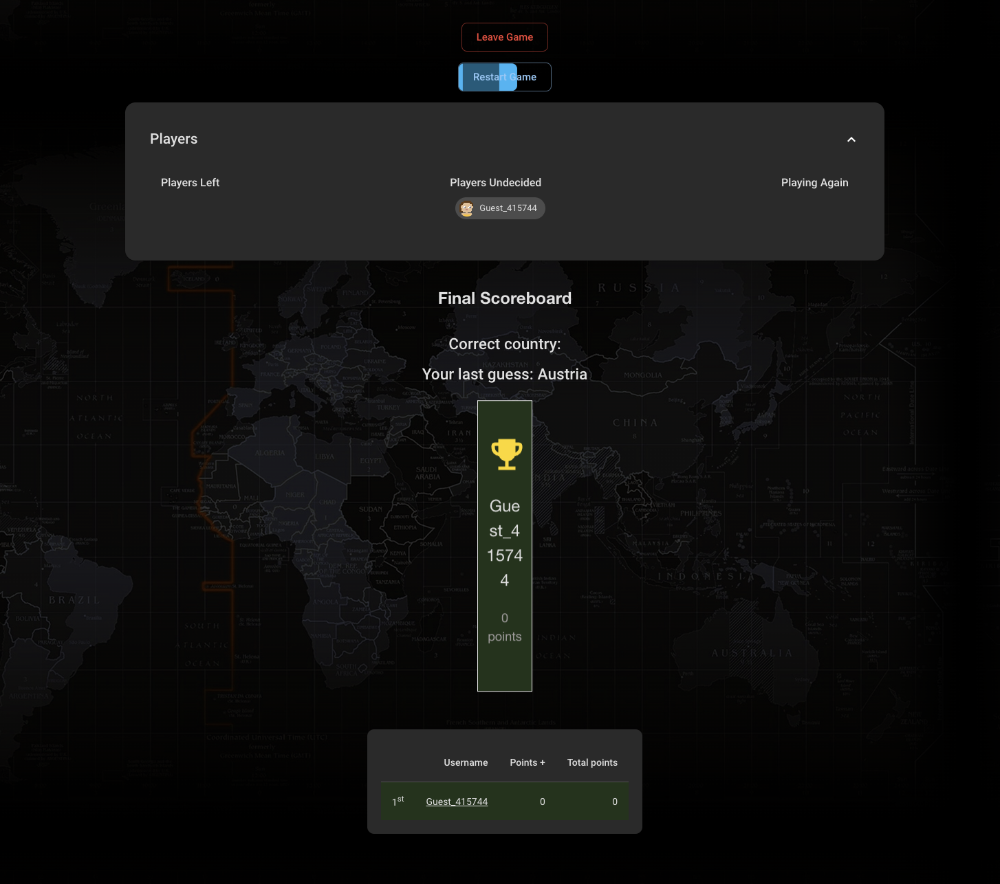

  

## Introduction

Our project aims to create an interactive platform that makes learning geography fun, engaging, and accessible. By challenging users to identify countries based on various clues, we hope to enhance their geographic knowledge across multiple domains. With this goal in mind, we designed the project to be user-friendly, visually appealing, and easy to navigate. Hope you enjoy...

## Technologies

- [Springboot](https://spring.io/) - Java framework to create a micro service
- [Gradle](https://gradle.org/) - Automated building and management tool
- [H2](https://www.h2database.com/html/main.html) - Database
- [React](https://reactjs.org/docs/getting-started.html) - Javascript library for the whole frontend
- [MUI](https://mui.com/) - CSS Component library
- [Github Projects](https://github.com/explore) - Project Management
- [Figma](https://figma.com/) - Mockups
- [Google Cloud](https://cloud.google.com/) - Deployment
- [SonarCloud](https://sonarcloud.io/) - Testing & Feedback of code quality

## Disclaimer
<bold>Be sure to use the "https" protocol when using the App. </bold>

## High-level components

### Landing Page
The landing page should inform the user about what GTC actually is. The next step is to make the user click on either the register button (if the user does not has an account) or click on the login button.

### Main Page

After registering the user will be redirected to the main page. There the user will have the option to either start a game, join a game, read the rules or click on the menu to have further options such as editing the profile, learning the countries in a flashcard mode and logging out.

### Game Creation

On the game creation page the user has the option to create a game and modify different settings such as the round duration, order of hints and which hints, the game mode, which regions, the difficulty, the time between each round and how many guesses each player has available.

### Lobby Overview

In the lobby overview page the user has 3 possiblilities to join a game: Either use the Quickjoin button to join the lobby with the most participants, use a lobby code or use the lobby overview table to join any of the open lobbies.

### Game Lobby

In the game lobby the users can see the lobby joining information where a QR code to the lobby is provided as well as the lobby code and the lobby link. On this page there is also some additional information such as the current participants and an overview of the game settings.

### Gameplay

During a game the particiapants are supposed to guess a country based on the various hints which will appear in intervals of 9 seconds (per default). In the "Classic" mode the user is supposed to type in the guess using the search box which has autocompletion. In the "Blitz" mode there are several buttons and the user is supposed to click on the correct button. The faster a correct guess is made the more points you get.

### Scoreboard

At the end of each round and at the end of the game the scoreboard is displayed, showing the placement of each user and how many points everyone has gained in the previous round.

## Deployment on Google Cloud and Raspberry PI

Our application is hosted on both [Google Cloud URL](https://sopra-fs23-group-20-client.oa.r.appspot.com/) and [Raspberry Pi URL](https://sopra-fs23-group20-client.pktriot.net/). To differentiate between the server URL for those two versions, a custom build is required for the Raspberry Pi version. This specification is outlined in the "scripts" and "build:custom" sections of our [package.json](package.json) file.

When the "npm run build:custom" command is executed, the REACT_APP_API_URL is automatically set to the Raspberry Pi's hosted server address: [https://sopra-fs23-group20-server.pktriot.net](https://sopra-fs23-group20-server.pktriot.net). This ensures that the [getDomain.ts](src/helpers/getDomain.ts) script sets the correct server URL, which is crucial for establishing a connection between the client and the server.

At some point we will run out of credits in the Google Cloud, in this case only the Raspberry PI version will be accessible.

## Launch

## Prerequisites and Installation

For your local development environment, you will need Node.js. You can download it [here](https://nodejs.org). All other dependencies, including React, get installed with:

`npm install`

Run this command before you start your application for the first time. Next, you can start the app with:

`npm run dev`

Now you can open [http://localhost:3000](http://localhost:3000) to view it in the browser.

Notice that the page will reload if you make any edits. You will also see any lint errors in the console (use Google Chrome).

### Testing

Testing is optional, and you can run the tests with `npm run test`.
This launches the test runner in an interactive watch mode. See the section about [running tests](https://facebook.github.io/create-react-app/docs/running-tests) for more information.

> For macOS user running into a 'fsevents' error: https://github.com/jest-community/vscode-jest/issues/423

### Build

Finally, `npm run build` builds the app for production to the `build` folder. 
It correctly bundles React in production mode and optimizes the build for the best performance: the build is minified, and the filenames include hashes. 

See the section about [deployment](https://facebook.github.io/create-react-app/docs/deployment) for more information.

## Illustrations
### Landing Page
The landing page should look like a modern "landing page" by giving the user a short introduction and should make the user clicking on the register button.     

### Main Page

After registering the user will be redirected to the main page. There the user will have the option to either start a game, join a game, read the rules or click on the menu to have further options such as editing the profile, learning the countries in a flashcard mode and logging out.    

### Game Creation

On the game creation page the user has the option to create a game and modify different settings as shown in the picture.    

### Lobby Overview

In the lobby overview page the user has 3 possiblilities to join a game: Either use the Quickjoin button to join the lobby with the most participants, use a lobby code, or use the lobby overview table to join any of the open lobbies.    

### Game Lobby

In the game lobby the users can see the lobby joining information where a QR code to the lobby is provided as well as the lobby code and the lobby link. On this page there is also some additional information such as the current participants and an overview of the game settings.    

### Gameplay

During a game the particiapants are supposed to guess a country based on the various hints which will appear in intervals of 9 seconds (per default). In the "Classic" mode the user is supposed to type in the guess using the search box which has autocompleton. In the "Blitz" mode there are several buttons and the user is supposed to click on the correct button. The faster a correct guess is made the more points you get.    

### Scoreboard

At the end of each round and at the end of the game the scoreboard is displayed, showing the placement of each user and how many points everyone has gained in the previous round.    

## Roadmap

### Mobile Compatibility

Our web application is mostly mobile-friendly, but some pages may still require improvements in scaling for optimal viewing on different devices. Another idea in this area would be to implement the project as a dedicated mobile app.

### Add additional Hints

So far we have the following 5 hints based on which the users can try to guess a country: Population, Outline, Location, Flag and Capital. Ideas for additional hints: Most famous landmark, Currency, GDP, National Anthem, Neighboring Countries, ...

### Friends System

The option to add friends, compare yourself with them and invite them to a lobby.

### Achievements

To encourage user engagement and acknowledge accomplishments, it would make sense to implement a series of achievements, including: first correct country guess, first game played, first game won, first friend added, 10 correct country guesses, 10 games played, 10 games won, 10 friends added, and more.

## Authors and acknowledgment

### Contributors

- **Jonas Blum** - [Github](https://github.com/robonder)
- **Jonathan Contreras Urzua** - [Github](https://github.com/JonathanContrerasM)
- **Louis Huber** - [Github](https://github.com/L-Huber)
- **Dario Monopoli** - [Github](https://github.com/dariomonopoli-dev)
- **Jamo Sharif** - [Github](https://github.com/JSha91)

### Supervision

- **Mete Polat** - [Github](https://github.com/polatmete)

## License

[Apache license 2.0](https://github.com/sopra-fs23-group-20/server/blob/6dc8281b0a876fa1d310626a704e0e4bfa08b86d/LICENSE)
